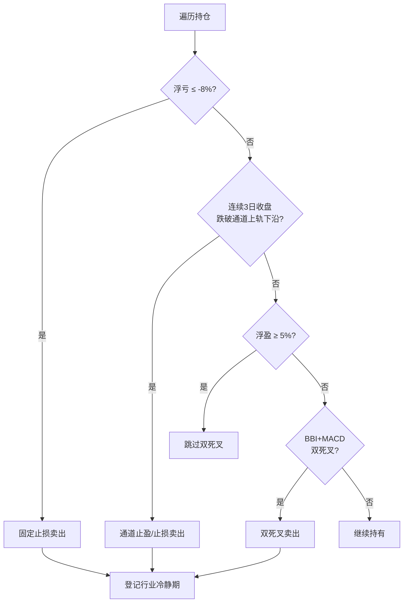

# trade2a1t1 详细交易策略说明

> 对应代码文件：`trade2a1t1`  
> 平台：聚宽（JoinQuant）  
> 基准：沪深300（000300.XSHG）  
> 版本：trade2 优化第一代（t1）

---

## 1. 策略定位

### 1.1 一句话描述

在 **CANSLIM 高成长基本面池** 中，筛选处于 **Stage2 上升趋势** 且出现 **价格行为买点**（楔形突破 / EMA 回踩 / 基底突破）的 A 股，结合 **大盘趋势动态控仓**，以 **固定止损 + 通道止盈 + 分级双死叉** 退出，并通过 **申万三级行业冷静期** 降低板块集中反复亏损。

### 1.2 策略类型


| 维度   | 描述                          |
| ---- | --------------------------- |
| 方向   | 仅做多                         |
| 周期   | 中短期趋势（典型持仓数日至数十日，盈利单倾向长期持有） |
| 风格   | 成长 + 趋势 + 价格行为              |
| 换仓频率 | 低（每日 10:00 统一交易一次）          |
| 最大持仓 | 5 只                         |
| 单票上限 | 总资产 20%                     |


### 1.3 相对 trade2 的核心改进


| 项目     | trade2   | trade2a1t1                      |
| ------ | -------- | ------------------------------- |
| 最大持仓   | 3 只      | **5 只**                         |
| 单票仓位   | 均分目标仓位   | **均分且 capped 20%**              |
| 行业风控   | 无        | **申万三级，卖出后 20 交易日禁买同行业**        |
| 双死叉    | 始终启用     | **仅浮盈 <5% 启用；≥5% 跳过；>15% 明确跳过** |
| EMA 回踩 | 仅日线      | **先周线 EMA 回踩，再日线**              |
| 买入分散   | 无        | **同行业不重复持仓**                    |
| 形态优先级  | score 排序 | **楔形(100) > EMA(85) > 基底(80)**  |


---

## 2. 每日运行时间表

```
07:30  before_trading_start   盘前选股，生成 g.today_stocks
10:00  market_open_trade      先卖后买（唯一交易时点）
15:00  after_market_close      更新通道跌破计数 + 净值统计
```


---

## 3. 选股体系（四层漏斗）

### 3.1 漏斗总览

```
Layer 1  CANSLIM 基本面 SQL          → 约 150 只
Layer 2  合规 + 行业冷静期过滤        → 剔除 ST/北交所/次新/冷静行业
Layer 3  日线技术面过滤              → 200MA、52周高点、价格、成交额
Layer 4  Stage2 + 价格行为形态        → wedge / EMA / base
         按 score 排序，取 TOP 30
```

### 3.2 Layer 1：CANSLIM 基本面

**数据来源：** 聚宽 `get_fundamentals`，以 `context.previous_date` 为财报日。


| 指标      | 条件           |
| ------- | ------------ |
| 流通市值    | 20 亿 ~ 500 亿 |
| 净利润同比增长 | > 30%        |
| 营收同比增长  | > 30%        |
| ROE     | > 8%         |
| EPS     | > 0          |


**排序：** 净利润增速降序，取前 **150** 只。

**设计意图：** 锁定高成长中小盘，与趋势突破策略匹配；同时排除过小（流动性差）和过大（弹性不足）标的。

### 3.3 Layer 2：合规与行业过滤


| 规则            | 说明                             |
| ------------- | ------------------------------ |
| ST / *ST / 退市 | 名称或 `is_st` 标志                 |
| 北交所 / 新三板     | 代码前缀 8/9/43/83/87              |
| 指数代码          | 399 开头                         |
| 次新股           | 上市不足 **120** 自然日               |
| **申万三级行业冷静期** | 该行业有股票卖出后 **20 个交易日内** 不再纳入候选池 |


**行业数据：** 通过 `get_industry(stock, date)` 读取 `sw_l3`（申万三级），缓存于 `g.stock_sw_l3`。

### 3.4 Layer 3：日线技术面

对 Layer 2 剩余股票，用近 250 日日线数据过滤：


| 条件       | 参数                 | 含义           |
| -------- | ------------------ | ------------ |
| 52 周高点回撤 | ≤ 30%              | 仍处相对强势，非深度熊市 |
| 200 日均线  | 收盘价 ≥ MA200 × 0.95 | 长期趋势未破       |
| 最低价格     | ≥ 20 元             | 过滤低价股        |
| 20 日均成交额 | ≥ 1 亿元             | 流动性保障        |


### 3.5 Layer 4：Stage2 + 价格行为形态

**Stage2 前提：** 收盘价 ≥ MA200 × 0.95（与 Layer 3 一致，形态层再次确认）。

形态检测 **按优先级匹配，命中即返回**（一只股票只归属一种形态）：


| 优先级 | 形态     | 内部键             | 得分      | 量比要求                   |
| --- | ------ | --------------- | ------- | ---------------------- |
| 1   | 楔形突破   | `wedge_pop`     | **100** | 当日量 > 20 日均量 × **1.5** |
| 2   | EMA 回踩 | `ema_crossback` | **85**  | 无（但需周线先过）              |
| 3   | 基底突破   | `base_break`    | **80**  | 当日量 > 20 日均量 × **1.3** |


**候选池排序：**

1. `score` 降序（100 > 85 > 80）
2. 同分则楔形 > EMA > 基底

最终取 **TOP 30** 写入 `g.today_stocks`，供 10:00 买入使用。

---

## 4. 形态定义（技术细节）

### 4.1 楔形突破（wedge_pop，score=100）

**含义：** 上升楔形整理后向上突破，伴随放量。

**条件：**

1. 近 15 日高点中至少 3 个局部高点，且 **逐级降低**（楔形上沿下倾）
2. 收盘价突破近 3 日最高价
3. EMA10 > EMA20，且 EMA10 高于 3 日前 EMA10
4. 收盘价 > EMA10 > EMA20
5. 成交量 > 20 日均量 × 1.5

### 4.2 EMA 回踩（ema_crossback，score=85）

**含义：** 上升趋势中回踩 EMA10 后再度站稳，**周线 + 日线双重确认**。

#### 第一步：周线 EMA 回踩（`_detect_weekly_ema_crossback`）

使用近 30 周周线数据：

1. 过去 8 周内（不含最新周）至少有一周收盘 ≤ 当周 EMA10 × **1.02**（触及）
2. 最新周收盘 ≥ EMA10 × **0.99**（站稳）
3. 周 EMA10 > 周 EMA20，且周 EMA10 高于 3 周前

**未通过周线 → 直接排除 EMA 回踩形态。**

#### 第二步：日线 EMA 回踩（`_detect_ema_crossback`）

1. 过去 10 日内（不含昨日）至少有一天收盘 ≤ EMA10 × **1.01**
2. 昨日收盘 ≥ EMA10 × **0.995**
3. EMA10 > EMA20，且 EMA10 高于 3 日前

### 4.3 基底突破（base_break，score=80）

**含义：** 窄幅整理平台后向上突破。

**条件：**

1. 第 -20 至 -5 日区间振幅 ≤ **8%**（基底紧凑）
2. 收盘价突破基底区间最高价
3. EMA10 > EMA20
4. 收盘价 > EMA10 > EMA20
5. 成交量 > 20 日均量 × 1.3

---

## 5. 大盘评分与仓位管理

### 5.1 大盘评分（get_market_score）

**标的：** 上证指数 000001（注意：基准为沪深 300，评分标的与之不同）。

**输入：** 近 60 日收盘价。


| 价格位置             | 基础分 |
| ---------------- | --- |
| 收盘 > MA20 > MA60 | 80  |
| 收盘 > MA20        | 60  |
| 收盘 > MA60        | 40  |
| 其他               | 30  |


**20 日涨跌幅修正：**

- 20 日涨幅 > 5% → 加分 10（上限 90）
- 20 日跌幅 > 5% → 减分 10（下限 20）

### 5.2 目标总仓位（calculate_position_ratio）


| 大盘评分 | 目标仓位（占总资产） |
| ---- | ---------- |
| ≥ 70 | 100%       |
| ≥ 55 | 80%        |
| ≥ 40 | 60%        |
| ≥ 25 | 40%        |
| < 25 | 20%        |


### 5.3 单票目标市值

```
per_stock_target = min(
    总资产 × position_ratio / max_holdings,
    总资产 × max_position_pct
)
```

**示例：** 总资产 100 万，评分 70（100% 仓位），5 只持仓：

- 均分：100万 × 100% / 5 = **20 万/只**
- 上限：100万 × 20% = **20 万/只**
- 结果：每只目标 **20 万**（满仓时恰好打满 5×20%=100%）

**买入门槛：** 大盘评分 **< 30** 时暂停一切新开仓。

---

## 6. 买入规则（10:00）

### 6.1 前置条件（任一不满足则不买）

- `g.today_stocks` 非空
- 当前持仓数 < **5**
- 大盘评分 ≥ **30**

### 6.2 候选股过滤（按排序依次检查）


| #   | 规则                       |
| --- | ------------------------ |
| 1   | 未持有该股票                   |
| 2   | 当日未卖出该股票（`g.sold_today`） |
| 3   | 不在 **申万三级行业冷静期**         |
| 4   | **不与现有持仓同行业**（申万三级）      |
| 5   | 未停牌                      |
| 6   | 非 ST / 北交所               |
| 7   | 未涨停（现价 < 涨停价 × 99.8%）    |


### 6.3 买入执行

- 按候选池 **score 从高到低** 依次买入，直至填满天数空位
- 每选中一只同行业股票，将该申万三级行业加入 `held_industries`，后续候选跳过同行业
- 目标市值 = `min(per_stock_target, 可用现金)`
- 目标市值 < 5000 元则跳过
- 科创板（688）使用限价单：买入价 ≤ 现价 × 1.02

### 6.4 买入记录（g.buy_info）

```python
{
    'buy_price': 成交价,
    'buy_date':  买入 datetime,
    'setup':     形态键,
    'score':     形态得分,
    'detail':    形态细节字符串,
    'sw_l3':     申万三级代码,
}
```

---

## 7. 卖出规则（10:00，严格优先级）

对每只持仓 **按顺序** 检查，**触发第一条即卖出并跳过后续规则**。




### 7.1 规则一：固定止损（-8%）

```
浮盈率 = (现价 - 成本) / 成本
若 浮盈率 ≤ -8%  →  卖出，原因：固定止损-8%
```

- 仅在 **10:00** 检查一次（无盘中复检）
- 急跌日可能存在滑点，实际亏损或超过 8%

### 7.2 规则二：通道止盈 / 趋势退出

**指标：** 多空通道「上轨下沿」（趋势1）

**计算逻辑：**

1. 加权均价 WP = EMA(Close×Volume, N) / EMA(Volume, N)，N = 3/6/12/24
2. CTA2 = EMA( (WP3+WP6+WP12+WP24)/4 , 13 )
3. 趋势1 = CTA2 × **1.01**

**计数机制（15:00 盘后更新）：**

- 若 **收盘价 < 趋势1** → `break_upper_count[stock] += 1`
- 若 **收盘价 ≥ 趋势1** → 计数清零

**卖出触发（10:00）：** `break_upper_count[stock] >= 3`

即 **连续 3 个交易日收盘跌破通道上轨下沿** 时卖出。  
该规则 **不区分盈亏**，是策略的主要止盈/趋势跟踪退出方式。

### 7.3 规则三：BBI + MACD 双死叉（分级启用）

**仅在浮盈率 < 5% 时检查**（含亏损和小幅盈利 0~5%）。


| 浮盈率      | 双死叉            |
| -------- | -------------- |
| < 5%     | **启用**         |
| 5% ~ 15% | **不检查**        |
| > 15%    | **不检查**（让利润奔跑） |


**BBI 死叉：** 昨日收盘 ≥ BBI 且 今日收盘 < BBI  
（BBI = (MA6+MA12+MA24+MA48)/4）

**MACD 死叉：** 昨日 MACD ≥ Signal 且 今日 MACD < Signal  
（参数：5, 10, 15）

**两者同时成立 → 卖出**，原因：`BBI+MACD双死叉`

### 7.4 卖出后动作（_do_sell）

1. 下单清仓
2. 写 `[卖出]` 日志（含形态、得分、盈亏）
3. 加入 `g.sold_today`（当日不再买回同股）
4. **登记申万三级行业冷静期 20 交易日**
5. 清除 `g.buy_info` 和 `g.break_upper_count`

---

## 8. 行业冷静期机制

### 8.1 触发

任意卖出（止损 / 通道 / 双死叉）成功后，读取该股的 **申万三级行业代码**。

### 8.2 持续时间

从 **卖出当日** 起计，向后第 **20 个交易日** 的日期为 `until`。

```python
g.industry_cooldown[sw_l3_code] = until_date
```

### 8.3 影响范围


| 场景       | 行为             |
| -------- | -------------- |
| 盘前选股     | 冷静期行业内股票跳过     |
| 基本面池过滤   | 同上             |
| 10:00 买入 | 跳过冷静期行业        |
| 买入分散     | 已有持仓的行业不再新开同行业 |


### 8.4 过期清理

每日 07:30 调用 `_purge_expired_cooldowns`，删除 `until < 今日` 的记录。

---

## 9. 交易成本与滑点


| 项目     | 设置                              |
| ------ | ------------------------------- |
| 印花税（卖） | 0.1%                            |
| 佣金（买卖） | 0.025%，最低 5 元                   |
| 滑点     | 固定 0.1%（`FixedSlippage(0.001)`） |
| 成交价    | 真实价格（`use_real_price=True`）     |


---

## 10. 状态变量一览


| 变量                    | 类型   | 用途                         |
| --------------------- | ---- | -------------------------- |
| `g.today_stocks`      | list | 当日候选池（07:30 写入，10:00 用后清空） |
| `g.sold_today`        | set  | 当日已卖出股票                    |
| `g.buy_info`          | dict | 买入元数据（日志、分析）               |
| `g.break_upper_count` | dict | 通道跌破连续天数                   |
| `g.industry_cooldown` | dict | 申万三级 → 冷静期截止日期             |
| `g.stock_sw_l3`       | dict | 股票 → 申万三级缓存                |
| `g.daily_nav`         | list | 每日净值序列                     |


---

## 11. 可调参数速查


| 参数                           | 默认值  | 说明                       |
| ---------------------------- | ---- | ------------------------ |
| `g.max_holdings`             | 5    | 最大同时持仓                   |
| `g.max_position_pct`         | 0.20 | 单票占总资产上限                 |
| `g.hard_stop`                | 0.08 | 固定止损比例                   |
| `g.profit_skip_dead_cross`   | 0.15 | 超过此盈利不做双死叉               |
| `g.loss_keep_dead_cross`     | 0.05 | 仅低于此盈利才做双死叉              |
| `g.industry_cooldown_days`   | 20   | 行业冷静期（交易日）               |
| `g.max_correction_from_high` | 0.30 | 52 周高点最大回撤               |
| `g.min_price`                | 20.0 | 最低股价                     |
| `g.min_avg_money`            | 1e8  | 最低 20 日均成交额              |
| `g.max_stock_output`         | 30   | 候选池上限                    |
| 买入暂停评分                       | 30   | 硬编码于 `market_open_trade` |
| 通道跌破天数                       | 3    | 硬编码于卖出逻辑                 |


---

## 12. 策略逻辑总结

### 12.1 盈利路径（设计预期）

1. CANSLIM 选出高成长 + 趋势向上的股票
2. Stage2 形态确认买点（优先楔形，EMA 需周线确认）
3. 大盘好时提高仓位，分散 5 行业
4. 盈利扩大后 **关闭双死叉**，靠 **通道 3 日跌破** 让利润奔跑
5. 行业冷静期避免在同一板块反复止损

### 12.2 风控路径

1. **-8% 硬止损** 限制单笔大亏
2. **浮盈 <5% 双死叉** 提前退出弱势小盈/小亏单
3. **行业冷静期** 降低板块系统性风险
4. **同行业不重复持仓** 强制分散
5. **大盘评分 <30 停买** 熊市减少暴露

### 12.3 已知局限（后续可优化）


| 局限           | 说明              |
| ------------ | --------------- |
| 止损仅 10:00 一次 | 跳空可能扩大实际亏损      |
| 大盘评分用 000001 | 与基准 000300 不一致  |
| 买入门槛评分=30 偏低 | 熊市仍可能频繁交易       |
| EMA 日线条件仍较宽  | 依赖周线过滤补偿        |
| 无个股冷静期       | 仅行业级冷静，同股可换行业再买 |


---

## 13. 日志格式（便于回测分析）

### 13.1 筛选日志

```
[筛选] 基本面SQL: N 只
[筛选] 合规过滤后: N 只 (剔除 X)
[筛选] 技术面通过后: N 只 (剔除 X)
[筛选] Stage2形态通过: N 只
[筛选] 行业冷静期剔除: N 只
[筛选] 股票池: A、B、C
```

### 13.2 卖出日志

```
[卖出] 名称(代码) 盈利/亏损X.X% | 原因:... | 选入:形态 | 细节:... | 得分N
[行业冷静] 名称 申万三级:CODE → YYYY-MM-DD 前禁买同行业
```

### 13.3 盘后统计

```
策略净值 / 累计收益 / 最大回撤 / 行业冷静期数量
```

---

## 14. 回测建议配置


| 配置项  | 建议值                                  |
| ---- | ------------------------------------ |
| 回测区间 | 2021-07-01 ~ 2023-06-01（与 trade2 对比） |
| 初始资金 | 100 万（或与 trade2 相同）                  |
| 基准   | 000300.XSHG                          |
| 频率   | 日频                                   |
| 对比基线 | trade2 + log.txt                     |


---

## 15. 文件关系

```
trade2          原始策略
trade2a1        优化需求清单
trade2a.md      trade2 分析与优化方案
trade2a1t1      本策略可执行代码
trade2a1t1a.md  本策略详细说明（本文档）
```

---

*文档随 `trade2a1t1` 代码同步维护。代码变更时请同步更新对应章节。*