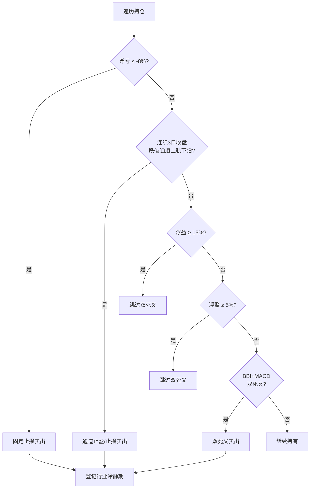

# trade2at2 详细交易策略说明

> 对应代码文件：`trade2at2`  
> 平台：聚宽（JoinQuant）  
> 基准：沪深300（000300.XSHG）  
> 版本：trade2 精简优化版（at2）

---

## 1. 策略定位

### 1.1 一句话描述

在 **CANSLIM 高成长基本面池** 中，筛选 **Stage2 上升趋势 + 价格行为买点** 的 A 股，结合 **大盘趋势动态控仓**，以 **固定止损 + 通道止盈 + 分级双死叉** 退出；并引入 **申万三级行业冷静期**，减少同一板块反复止损。

### 1.2 设计哲学

`trade2at2` 是 **「trade2 骨架 + trade2at1 两项验证有效优化」** 的折中版本：

- **保留 trade2 的简单性**：3 只持仓、均分仓位、按 score 排序
- **只移植 trade2at1 里回测证明最有效的两项**：分级双死叉、行业冷静期
- **暂不引入** trade2at1 的 5 只/20% 上限、楔形优先排序、同行业禁重复持仓（便于 A/B 对比）

### 1.3 策略类型

| 维度 | 描述 |
|------|------|
| 方向 | 仅做多 |
| 周期 | 中短期趋势（典型持仓数日至数十日） |
| 风格 | 成长 + 趋势 + 价格行为 |
| 换仓频率 | 低（每日 10:00 统一交易一次） |
| 最大持仓 | **3 只** |
| 单票仓位 | 目标总仓位 / 3（无 20% 硬上限） |

### 1.4 三代策略对比

| 项目 | trade2 | **trade2at2** | trade2at1 |
|------|--------|---------------|-----------|
| 最大持仓 | 3 只 | **3 只** | 5 只 |
| 单票上限 | 均分 | **均分** | capped 20% |
| 行业冷静期 | 无 | **申万三级，10 交易日** | 申万三级，10 交易日 |
| 双死叉 | 始终启用 | **分级启用** | 分级启用 |
| 形态排序 | score 降序 | **score 降序** | score + 楔形优先 |
| 同行业禁重复持仓 | 无 | **无** | 有 |
| 代码复杂度 | 低 | **中** | 高 |

---

## 2. 每日运行时间表

```
07:30  before_trading_start   盘前选股，生成 g.today_stocks
10:00  market_open_trade      先卖后买（唯一交易时点）
15:00  after_market_close      通道计数 + 净值统计 + 行业冷静期递减
```


---

## 3. 选股体系（四层漏斗）

### 3.1 漏斗总览

```
Layer 1  CANSLIM 基本面 SQL          → 约 150 只
Layer 2  合规 + 行业冷静期过滤        → 剔除 ST/北交所/次新/冷静行业
Layer 3  日线技术面过滤              → 200MA、52周高点、价格、成交额
Layer 4  Stage2 + 价格行为形态        → wedge / EMA / base
         按 score 降序，取 TOP 30
```

### 3.2 Layer 1：CANSLIM 基本面

**数据来源：** 聚宽 `get_fundamentals`，以 `context.previous_date` 为财报日。

| 指标 | 条件 |
|------|------|
| 流通市值 | 20 亿 ~ 500 亿 |
| 净利润同比增长 | > 30% |
| 营收同比增长 | > 30% |
| ROE | > 8% |
| EPS | > 0 |

**排序：** 净利润增速降序，取前 **150** 只。

### 3.3 Layer 2：合规与行业过滤

| 规则 | 说明 |
|------|------|
| ST / *ST / 退市 | 名称或 `is_st` 标志 |
| 北交所 / 新三板 | 代码前缀 8/9/43/83/87 |
| 指数代码 | 399 开头 |
| 次新股 | 上市不足 **120** 自然日 |
| **申万三级行业冷静期** | 该行业有股票卖出后 **10 个交易日内** 不再纳入候选池 |

**行业数据：** `get_industry(stock, date)` → `sw_l3`，缓存于 `g.stock_sw_l3`。

**冷静期实现：** 卖出时写入 `g.industry_cooldown[sw3] = 10`；每交易日盘后 `-1`，到 0 删除。不使用 `get_trade_days`，避免未来函数。

### 3.4 Layer 3：日线技术面

| 条件 | 参数 | 含义 |
|------|------|------|
| 52 周高点回撤 | ≤ 30% | 仍处相对强势 |
| 200 日均线 | 收盘价 ≥ MA200 × 0.95 | 长期趋势未破 |
| 最低价格 | ≥ 20 元 | 过滤低价股 |
| 20 日均成交额 | ≥ 1 亿元 | 流动性保障 |

### 3.5 Layer 4：Stage2 + 价格行为形态

形态检测 **按优先级匹配，命中即返回**（一只股票只归属一种形态）：

| 优先级 | 形态 | 内部键 | 得分 | 量比要求 |
|--------|------|--------|------|----------|
| 1 | 楔形突破 | `wedge_pop` | **100** | 当日量 > 20 日均量 × **1.5** |
| 2 | EMA 回踩 | `ema_crossback` | **85** | 无 |
| 3 | 基底突破 | `base_break` | **80** | 当日量 > 20 日均量 × **1.3** |

**候选池排序：** 仅 `score` 降序（**无** trade2at1 的「同分楔形优先」二次排序）。

最终取 **TOP 30** 写入 `g.today_stocks`。

---

## 4. 形态定义（技术细节）

### 4.1 楔形突破（wedge_pop，score=100）

1. 近 15 日高点中至少 3 个局部高点，且 **逐级降低**
2. 收盘价突破近 3 日最高价
3. EMA10 > EMA20，且 EMA10 高于 3 日前 EMA10
4. 收盘价 > EMA10 > EMA20
5. 成交量 > 20 日均量 × 1.5

### 4.2 EMA 回踩（ema_crossback，score=85）

**与 trade2 相同，仅日线确认（无 trade2a1t1 的周线过滤）：**

1. 过去 10 日内（不含昨日）至少有一天收盘 ≤ EMA10 × **1.01**
2. 昨日收盘 ≥ EMA10 × **0.995**
3. EMA10 > EMA20，且 EMA10 高于 3 日前

### 4.3 基底突破（base_break，score=80）

1. 第 -20 至 -5 日区间振幅 ≤ **8%**
2. 收盘价突破基底区间最高价
3. EMA10 > EMA20
4. 收盘价 > EMA10 > EMA20
5. 成交量 > 20 日均量 × 1.3

---

## 5. 大盘评分与仓位管理

### 5.1 大盘评分（get_market_score）

**标的：** 上证指数 000001（基准为沪深 300，评分标的与之不同）。

| 价格位置 | 基础分 |
|----------|--------|
| 收盘 > MA20 > MA60 | 80 |
| 收盘 > MA20 | 60 |
| 收盘 > MA60 | 40 |
| 其他 | 30 |

**20 日涨跌幅修正：** 涨幅 > 5% → +10（上限 90）；跌幅 > 5% → -10（下限 20）。

### 5.2 目标总仓位（calculate_position_ratio）

| 大盘评分 | 目标仓位 |
|----------|----------|
| ≥ 70 | 100% |
| ≥ 55 | 80% |
| ≥ 40 | 60% |
| ≥ 25 | 40% |
| < 25 | 20% |

### 5.3 单票目标市值（trade2 方式）

```
per_stock_target = 总资产 × position_ratio / max_holdings
                 = 总资产 × position_ratio / 3
```

**示例：** 总资产 100 万，评分 70（100% 仓位），3 只持仓：

- 每只目标：**100万 × 100% / 3 ≈ 33.3 万**
- 满仓时总暴露约 **100%**

**买入门槛：** 大盘评分 **< 30** 时暂停一切新开仓。

**已知局限：** `position_ratio` 只约束**新开仓**，已有 3 只满仓时不会在评分下降时主动减仓（与 trade2/trade2at1 相同）。

---

## 6. 买入规则（10:00）

### 6.1 前置条件

- `g.today_stocks` 非空
- 当前持仓数 < **3**
- 大盘评分 ≥ **30**

### 6.2 候选股过滤

| # | 规则 |
|---|------|
| 1 | 未持有该股票 |
| 2 | 当日未卖出该股票（`g.sold_today`） |
| 3 | 不在 **申万三级行业冷静期** |
| 4 | 未停牌 |
| 5 | 非 ST / 北交所 |
| 6 | 未涨停（现价 < 涨停价 × 99.8%） |

**注意：** 与 trade2at1 不同，**允许**同时持有同行业不同股票（只要不在冷静期）。

### 6.3 买入执行

- 按候选池 **score 从高到低** 依次买入，直至填满空位（最多补至 3 只）
- 目标市值 = `min(per_stock_target, 可用现金)`
- 目标市值 < 5000 元则跳过
- 科创板（688）限价：买入价 ≤ 现价 × 1.02

### 6.4 买入记录（g.buy_info）

```python
{
    'buy_price': 成交价,
    'buy_date':  买入 datetime,
    'setup':     形态键,
    'score':     形态得分,
    'detail':    形态细节字符串,
}
```

---

## 7. 卖出规则（10:00，严格优先级）

对每只持仓 **按顺序** 检查，**触发第一条即卖出**。



### 7.1 规则一：固定止损（-8%）

```
浮盈率 = (现价 - 成本) / 成本
若 浮盈率 ≤ -8%  →  卖出，原因：固定止损-8%
```

- 仅在 **10:00** 检查一次
- 存在跳空滑点，实际亏损可能超过 8%

### 7.2 规则二：通道止盈 / 趋势退出

**指标：** 多空通道「上轨下沿」（趋势1 = CTA2 × 1.01）

**计数（15:00）：** 收盘 < 趋势1 → 计数 +1；否则清零

**卖出（10:00）：** `break_upper_count >= 3`（连续 3 日跌破）

### 7.3 规则三：BBI + MACD 双死叉（分级启用 — trade2at1 核心优化 #1）

| 浮盈率 | 双死叉 |
|--------|--------|
| **≥ 15%** | **关闭**（让利润靠通道退出） |
| **5% ~ 15%** | **跳过**（观察区，不触发双死叉） |
| **< 5%** | **启用**（含亏损与微盈，作保护） |

**BBI 死叉：** 昨日收盘 ≥ BBI 且 今日收盘 < BBI  
**MACD 死叉：** 昨日 MACD ≥ Signal 且 今日 MACD < Signal  
**两者同时成立** 才卖出。

**参数：**

```python
g.profit_skip_dead_cross = 0.15   # ≥15% 关闭
g.loss_keep_dead_cross = 0.05     # ≥5% 跳过（5~15% 观察区）
```

### 7.4 卖出后：行业冷静期（trade2at1 核心优化 #2）

任意卖出（止损 / 通道 / 双死叉）均调用 `_register_industry_cooldown`：

```
卖出 → 读取申万三级 sw_l3 → g.industry_cooldown[sw3] = 10
盘后 → 所有冷静期计数 -1 → 到 0 删除
选股/买入 → _is_industry_blocked 过滤
```

日志示例：

```
[行业冷静] 万泰生物 申万三级:850xxx → 禁买同行业 10 个交易日
[卖出] 万泰生物(603392) 亏损8.7% | 原因:固定止损-8% | 选入:EMA回踩 | ...
```

---

## 8. 关键参数一览

| 参数 | 默认值 | 说明 |
|------|--------|------|
| `g.max_holdings` | 3 | 最大持仓数 |
| `g.hard_stop` | 0.08 | 固定止损 8% |
| `g.profit_skip_dead_cross` | 0.15 | 浮盈 ≥15% 关闭双死叉 |
| `g.loss_keep_dead_cross` | 0.05 | 浮盈 ≥5% 跳过双死叉 |
| `g.industry_cooldown_days` | 10 | 行业冷静期（交易日） |
| `g.max_correction_from_high` | 0.30 | 52 周高点最大回撤 |
| `g.min_price` | 20.0 | 最低股价 |
| `g.min_avg_money` | 1e8 | 最低 20 日均成交额 |
| `g.max_stock_output` | 30 | 候选池输出上限 |

---

## 9. 相对 trade2 的预期改进

基于 `trade2_log.txt`（2021-07 ~ 2023-06）与 `trade2a1_log.txt`（trade2at1）的对比推断：

| 指标 | trade2 | trade2at1（参考） | trade2at2 预期 |
|------|--------|-------------------|----------------|
| 胜率 | 17.4% | 21.9%（同区间） | **接近 trade2at1** |
| 双死叉误杀 | 高（始终启用） | 低（分级） | **低** |
| 同行业反复买 | 68 次/30天 | 有冷静期 | **减少** |
| 通道盈利 | +110% | +405% | **介于两者之间** |
| 止损次数 | 40 | 49（5只更活跃） | **≈40（3只）** |
| 最大回撤 | 未测长周期 | -60%（10年） | **待回测** |

**trade2at2 相对 trade2at1 的潜在优势：**

- 3 只集中，单票仓位更大，趋势单利润可能更厚
- 止损绝对次数可能更少（持仓数少）
- 代码更短、逻辑更清晰，便于后续加「回撤刹车」

**trade2at2 相对 trade2at1 的潜在劣势：**

- 无单票 20% 上限，极端情况下单票暴露可达 ~33%
- 无同行业禁重复持仓，板块集中度可能更高
- 无楔形优先，候选池排序与 trade2at1 略有差异

---

## 10. 已知局限与后续优化路线

### 10.1 当前未实现（三代共同短板）

| 问题 | 影响 |
|------|------|
| 无组合级回撤刹车 | 2022 类长阴跌时净值持续下滑 |
| 评分只停买不减仓 | 熊市仍满 3 只扛单 |
| 无浮盈跟踪止损 | 大盈后仅靠 3 日通道，易回吐 |
| 止损仅 10:00 一次 | 跳空滑点 |
| 大盘评分用 000001 | 与沪深 300 基准不完全匹配 |

### 10.2 建议 Phase 2（在 trade2at2 上迭代）

```
Phase 2a  组合回撤刹车（净值高点 -10%/-15%/-20% 分级降仓）
Phase 2b  浮盈跟踪止损（≥15% 回撤 12% 卖；≥30% 回撤 8% 卖）
Phase 2c  大盘评分双向联动（评分<40 时主动减仓已有仓）
Phase 2d  止损双时点（10:00 + 14:30）或 ATR 止损
```

### 10.3 A/B 回测建议

在聚宽用 **相同区间** 对比三版：

| 版本 | 目的 |
|------|------|
| trade2 | baseline |
| **trade2at2** | 验证「最小改动」是否够好 |
| trade2at1 | 验证分散化（5×20%）是否值得额外复杂度 |

重点观察：**最大回撤、夏普、2022 年净贡献、止损次数**。

---

## 11. 日志格式

### 11.1 卖出日志

```
[卖出] 热景生物(688068) 亏损8.7% | 原因:固定止损-8% | 选入:EMA回踩 | 细节:10日内回踩EMA10,... | 得分85
```

### 11.2 行业冷静

```
[行业冷静] 热景生物 申万三级:850xxx → 禁买同行业 10 个交易日
```

### 11.3 盘后统计

```
========== 盘后统计 ==========
日期: 2022-03-15
策略净值: 3328513.00
策略累计收益: -33.71%
当前最大回撤: -18.50%
行业冷静期: {'850913': 7, '850351': 3}
================================
```

---

## 12. 文件关系

```
trade2          原始策略（743 行）
    │
    ├── trade2at1   + trade2a1 全部 4 项（838 行）
    │
    └── trade2at2   + 分级双死叉 + 行业冷静期（精简，~750 行）
            │
            └── trade2at2a.md   本文档
```

**选用建议：** 若回测证明 trade2at2 与 trade2at1 夏普/回撤接近，则 **以 trade2at2 为后续 Phase 2 开发底座**；若 5×20% 分散明显更优，再合并回 trade2at1 或出 trade2at3。
