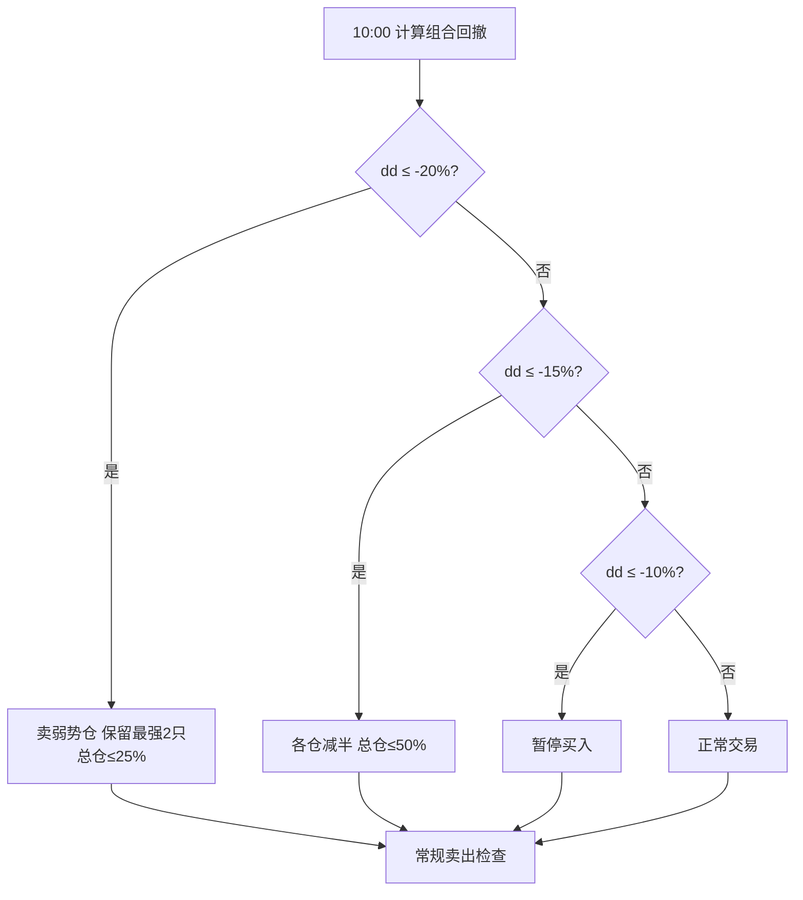

# trade2at3 详细策略说明 — 组合回撤刹车

> 对应代码：`trade2at3`  
> 平台：聚宽（JoinQuant）  
> 基准：沪深300（000300.XSHG）  
> 基线：`trade2`（仅新增 **1 项** 组合回撤刹车）

---

## 1. 策略定位

### 1.1 一句话

在 **trade2 完整逻辑不变** 的前提下，增加 **组合净值高点回撤分级响应**，在策略整体进入回撤时 **暂停买入 / 主动减仓**，避免 2022 类长阴跌中「停买但仍满仓扛单」。

### 1.2 相对 trade2 的唯一改动

| 项目 | trade2 | trade2at3 |
|------|--------|-----------|
| 选股 / 止损 / 通道 / 双死叉 | 原样 | **原样** |
| 组合回撤监控 | 无 | **有** |
| 回撤时减仓 | 无 | **有** |
| 回撤时停买 | 无 | **有** |

---

## 2. 组合回撤刹车规则

### 2.0 版本说明（v3 修复「刹车失效」）

| 版本 | 问题 |
|------|------|
| v1 | 终身高点 → 永久停买 |
| v2 | 120 日滚动峰值 + 当日资产纳入 peak → **慢跌时峰值跟着掉，回撤永远 <10%，刹车几乎不触发** |
| **v3** | **单调 HWM** 计回撤，慢跌也能累积；另加超时/反弹解除防锁死 |

**v3 回撤公式：**

```
brake_hwm = 历史最高资产（仅在新高时抬升，慢跌时不降）
dd = (当前资产 - brake_hwm) / brake_hwm
```

### 2.1 分级动作

| 组合回撤 | 阈值参数 | 动作 |
|----------|----------|------|
| ≥ 10% | `g.dd_pause_buy` | **暂停新开仓** |
| 相对 HWM 恢复 | `g.dd_resume_buy = 7%` | 解除停买（滞回） |
| 自停买低点反弹 | `g.dd_trough_bounce = 5%` | 解除停买 |
| 停买连续天数 | `g.dd_pause_max_days = 20` | 超时重置 HWM + 解除停买 |
| ≥ 15% | 减半 + HWM 重置 | **10 日减仓冷却**，冷却内不重复减半 |
| ≥ 20% | 留 2 只 / 25% + HWM 重置 | **10 日减仓冷却** |

### 2.2 日志关键字（回测检索）

| 标签 | 何时打印 |
|------|----------|
| `🛑 [停买触发]` | **首次** 触及 -10% |
| `⏸ [停买维持]` | 停买中，未满足恢复条件 |
| `🛑 [停买生效]` | 10:00 买入被跳过 |
| `✅ [停买恢复·滞回]` | 相对 HWM 回到 -7% 以上 |
| `✅ [停买恢复·反弹]` | 自停买低点反弹 ≥5% |
| `✅ [停买恢复·超时]` | 连续停买 20 天 |
| `⚠️ [减仓触发·moderate/severe]` | 触发 -15% / -20% |
| `🔻 [减仓完成·*]` | 减仓完成，进入冷却 |
| `🛡️ [减仓冷却]` | 冷却期内跳过重复减仓 |

每日 10:00 汇总行：

```
组合回撤: -11.20% (刹车HWM 520000 | ... | 停买=True 停买天数=3 | 减仓冷却=7天)
```



### 2.3 执行时点

- **10:00** `market_open_trade` 开头调用 `_apply_portfolio_dd_brake`
- 减仓在 **常规个股卖出之前** 执行
- 买入阶段：仅 `pause_buy` 跳过买入（`moderate`/`severe` 减仓后 HWM 已重置，可再买）

### 2.4 减仓算法

```python
目标持仓总市值 = 总资产 × exposure_ratio
每只目标市值 = 目标持仓总市值 / 持仓只数
若当前市值 > 目标 → order_target_value 减至目标
```

「保留最强 2 只」：按 **当前浮盈率** 降序，卖出排名 3 及以后的全部仓位，再对剩余 2 只做 25% 总暴露分配。

---

## 3. 未改动部分（与 trade2 相同）

- 3 只持仓、均分目标仓位
- 大盘评分 → `position_ratio`（仅约束买入）
- 固定止损 -8%（10:00 一次）
- 通道 3 日跌破退出
- BBI+MACD 双死叉（始终启用）
- CANSLIM + Stage2 价格行为选股

---

## 4. 关键参数

| 参数 | 默认值 | 说明 |
|------|--------|------|
| `g.dd_pause_buy` | 0.10 | 触发停买 |
| `g.dd_resume_buy` | 0.07 | 滞回恢复买入 |
| `g.dd_reduce_half` | 0.15 | 减半线 |
| `g.dd_reduce_quarter` | 0.20 | 留 2 只 + 25% 线 |
| `g.brake_hwm` | 0 | 刹车高水位（运行时） |
| `g.dd_pause_max_days` | 20 | 停买超时重置 |
| `g.dd_trough_bounce` | 0.05 | 低点反弹 5% 解除停买 |
| `g.dd_reduce_cooldown_days` | 10 | 减仓后冷却天数 |

---

## 5. 日志示例

```
🛑 [停买触发] 回撤 -11.20%≤-10%，HWM=520000，暂停新开仓
🛑 [停买生效] 跳过买入 mode=pause_buy dd=-11.20% (恢复: 滞回>-7% 或反弹5% 或超时20天)
```

```
⏸ [停买维持] dd=-9.50%，等待恢复(滞回>-7%/反弹5%/超时20天)
✅ [停买恢复·滞回] 相对HWM回撤 -6.50% > -7%，恢复买入
```

```
⚠️ [减仓触发·moderate] 回撤 -16.00%≤-15%：各仓减半
🔻 回撤刹车：减仓 600519.XSHG → 目标市值 165000
🔻 [减仓完成·moderate] dd=-16.00%，10 日内不再重复减仓
🔄 刹车HWM重置(moderate) → 410000
```

```
🛡️ [减仓冷却] 剩余 7 天，跳过减半/留2只（dd=-18.00%）
```

---

## 6. 回测对比建议

| 对比组 | 文件 |
|--------|------|
| 基线 | `trade2` |
| 本优化 | `trade2at3` |

**重点指标：** 最大回撤、2022 年净贡献、夏普比率、累计收益。

**预期：** 最大回撤下降，牛市收益可能略降（提前减仓）；2022 类年份失血应减轻。

---

## 7. 已知局限

- 停买期间仍可能因个股止损/通道卖出而空仓，需等恢复条件才能补入
- 减仓冷却内若继续下跌，仅停买/个股止损生效，不会连续砍仓
- 未与大盘评分联动（见 `trade2at7`）

---

## 8. 文件关系

```
trade2 ──+── trade2at3  (+组合回撤刹车)  ← 本文档
         ├── trade2at4  (+止损改造)
         ├── trade2at5  (+分级双死叉)
         ├── trade2at6  (+浮盈跟踪止损)
         └── trade2at7  (+评分双向联动)
```
