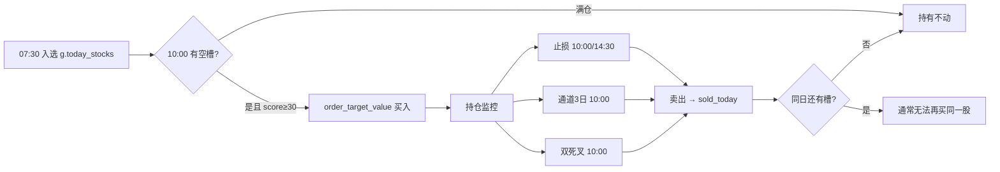

# trade2at4at5 策略深度分析

> 对应代码：`trade2at4at5`  
> 基线：`trade2at4` + **昨/今涨跌幅动量排序**  
> 本文重点：**持仓结构**与**下单仓位占比**，供后续优化（如 `trade2at4at5at*`）参考。  
> 持仓/交易行为部分结合 `trade2_log.txt`（trade2 同架构，2021-07~2023-06）归纳。

---

## 1. 策略总览

### 1.1 模块组成

| 模块 | 函数 / 定时 | 说明 |
|------|-------------|------|
| 盘前选股 | `before_trading_start` 07:30 | CANSLIM → 技术面 → Stage2 形态 → **动量加分排序** |
| 统一交易 | `market_open_trade` 10:00 | 先卖后买，**每日仅一次** |
| 止损复检 | `afternoon_stop_check` 14:30 | 仅 ATR/固定止损，不买卖 |
| 盘后 | `after_market_close` 15:00 | 通道跌破计数 + 净值 |

### 1.2 相对 trade2at4 的唯一增量

```python
总分 = 形态基础分(100/85/80) + 昨日涨跌幅(%)×因子 + 今日涨跌幅(%)×因子
```

- 07:30：仅加**昨日**动量  
- 10:00 买入前：刷新**今日**动量并重排 `g.today_stocks`  

其余：ATR 动态止损、10:00+14:30 双检、通道 3 日、双死叉、3 只持仓等与 trade2at4 相同。

---

## 2. 持仓体系（重点）

### 2.1 硬约束

| 参数 | 值 | 作用 |
|------|-----|------|
| `g.max_holdings` | **3** | 最多同时持有 3 只股票 |
| 买入门槛 | `market_score >= 30` | 低于 30 **停买**（仍可持仓、可卖） |
| 满仓门槛 | `current_count >= 3` | 不再开新仓 |
| `g.sold_today` | set | 当日已卖出标的**当天不再买入** |

### 2.2 持仓生命周期



### 2.3 卖出优先级（10:00，仅一次）

```
1. ATR/固定止损  pnl <= -threshold
2. 通道3日       break_upper_count >= 3
3. BBI+MACD 双死叉（无盈利保护，全区间生效）
```

14:30 只做止损，**不减仓、不加仓**。

### 2.4 从 trade2 日志看持仓特征

> trade2at4at5 架构与 trade2 一致，日志具有参考价值。

| 维度 | 数据 | 含义 |
|------|------|------|
| 完整卖出 | 115 笔 | 约 2 年 |
| 胜率 | 17.4% | 绝大多数单笔亏损 |
| ≤15 天持仓 | **68 笔（59%）** | 胜率 ~5%，主要失血区 |
| >30 天持仓 | 15 笔 | 胜率 **80%**，均盈 +14.1% |
| 2022 年 | 58 笔（最多） | 胜率 12%，熊市仍频繁交易 |
| 空仓日 | ~5%（23/466 天） | 绝大多数交易日有候选 |

**结论：** 策略「能拿长」才赚钱，但持仓体系导致大量**短持周转**；3 只槽位在熊市仍常被填满或快速换仓。

### 2.5 持仓结构问题清单

| # | 问题 | 代码位置 | 影响 |
|---|------|----------|------|
| H1 | **无存量仓位再平衡** | 买入段 | 老仓偏大/偏小，新仓按公式买，总暴露偏离目标 |
| H2 | **市况变差不减仓** | 无 | `position_ratio` 只约束新买，已有 3 只仍 100% 暴露 |
| H3 | **满仓即停买** | L481-482 | 即使有现金、评分高候选，也不换弱仓 |
| H4 | **卖后同日禁买** | `g.sold_today` | 止损后槽位空出，往往当天无法再补 |
| H5 | **无个股冷静期** | 无 | 万泰生物等反复买入（日志 6 次亏） |
| H6 | **无行业分散** | 无 | 同板块多槽占用 |
| H7 | **双死叉无盈利分级** | L433-468 | 盈利单也被砍，与「长持盈利」冲突 |
| H8 | **10:00 单次检查** | 全局 | 除 14:30 止损外，通道/死叉不盘中反应 |

---

## 3. 下单仓位占比（重点）

### 3.1 相关参数

```python
g.max_holdings = 3
g.position_size = 0.8          # ⚠️ 定义了但从未使用
```

大盘评分 → 目标总仓位 `position_ratio`（`calculate_position_ratio`）：

| 大盘评分 | position_ratio | 含义 |
|----------|----------------|------|
| ≥ 70 | **100%** | 目标满仓 |
| ≥ 55 | 80% | |
| ≥ 40 | 60% | |
| ≥ 25 | 40% | |
| < 25 | 20% | |

- 评分来源：**上证指数 000001**（与 benchmark 沪深300 不一致）  
- 停买阈值：**30**（约对应 40% 仓位档，仍偏激进）

### 3.2 单票目标市值公式

```python
total_value = context.portfolio.total_value
target_total_value = total_value * position_ratio
per_stock_target = target_total_value / g.max_holdings   # 始终 ÷3
target_value = min(per_stock_target, available_cash)
order_target_value(stock, target_value)
```

### 3.3 公式含义拆解

**设计意图（推测）：** 3 只均分，`position_ratio` 为组合总股票暴露上限。

| 场景 | 计算 | 实际总暴露 |
|------|------|------------|
| 空仓，score=80，一次买满 3 只 | 每只 = 100%×总资产/3 ≈ **33.3%** | ≈ **100%** ✓ |
| 空仓，score=50，买满 3 只 | 每只 = 80%/3 ≈ **26.7%** | ≈ **80%** ✓ |
| 已持 2 只，再买 1 只 | 新买 = 80%/3 ≈ 26.7% | 旧 2 只**不变** + 26.7% → **总暴露未知** |
| 已持 1 只（30%），score 从 70 降到 40 | 不卖、不买 | 仍 ~30%+，**未降至 60% 目标** |
| 止损卖 1 只后剩 2 只 | 槽位+1，但 sold_today 限制 | 常**留现金**至次日 |

### 3.4 数值示例（假设总资产 100 万）

| 大盘分 | ratio | per_stock_target | 买 3 只合计 | 买 1 只合计 |
|--------|-------|------------------|-------------|-------------|
| 80 | 100% | 333,333 | 1,000,000 | 333,333 |
| 50 | 80% | 266,667 | 800,000 | 266,667 |
| 35 | 60% | 200,000 | 600,000 | 200,000 |
| 28 | 40% | 133,333 | 400,000 | 133,333 |

最小下单：`target_value < 5000` 则跳过。

### 3.5 仓位占比问题清单

| # | 问题 | 说明 |
|---|------|------|
| P1 | **`g.position_size` 冗余** | 0.8 未参与任何计算 |
| P2 | **per_stock 固定 ÷3** | 买 1 只时也按 1/3 槽位算，无法「集中火力」单票 |
| P3 | **不随持仓数调整** | `slots_available=1` 时仍只买 1/3 目标，**大量现金闲置** |
| P4 | **无总暴露监控** | 日志只打「持仓总市值」，不打占总资产比例 |
| P5 | **sequential 现金扣减** | `available_cash -= target_value` 按序买；第一只占满现金后第二只可能不足 |
| P6 | **ratio 与 max_holdings 脱节** | 低分仍允许 3 槽 × 13.3%（40%/3），熊市分散且弱 |
| P7 | **动量排序不影响仓位** | 高分候选与低分候选**同市值**买入 |
| P8 | **科创板限价** | 688 限价 ±2%，目标市值可能**未完全成交** |

### 3.6 实际暴露推算

```
理论最大股票暴露 ≈ position_ratio × (实际持仓只数 / max_holdings)
```

| 持仓只数 | ratio=80% | 理论上限 |
|----------|-----------|----------|
| 3 | 80% | 80% |
| 2 | 80% | 53%（若第 3 槽未补） |
| 1 | 80% | 27% |
| 0 | — | 0% |

因 H1/H3/H4，回测中**常见「2~3 只持仓 + 10%~40% 现金」**，熊市并未真正降到 20% 总暴露（那是空仓且 ratio=20% 的上限）。

---

## 4. 买入流程逐步（10:00）

```
1. market_score → position_ratio
2. 止损 / 通道 / 双死叉 → 可能卖出 → sold_today
3. current_count = 当前持仓数
4. 若 count>=3 或 score<30 或 无候选 → 结束
5. 动量重排 g.today_stocks
6. slots = 3 - current_count
7. 按序筛候选（已持/卖过/停牌/ST/涨停…）取前 slots 个
8. 每只 target = min(total×ratio/3, available_cash)
9. order_target_value
10. 打印持仓市值（无占比%）
```

**注意：** 步骤 8 **不会**把已有持仓调到 `per_stock_target`；也**不会**因 `position_ratio` 下降而主动减仓。

---

## 5. 动量排序与持仓的交互

| 时点 | 行为 | 对仓位的影响 |
|------|------|--------------|
| 07:30 | 总分 = 基础 + 昨动量 | 决定候选顺序，**不影响单票金额** |
| 10:00 | +今动量重排 | 优先买「涨得多」的，可能**追高** |
| 买入 | 同 `per_stock_target` | 高分股并未多配资金 |

**优化缺口：** 动量只改「买谁」，不改「买多少」——排序收益无法通过仓位放大。

---

## 6. 日志可观测项（回测时建议补）

当前日志**缺少**以下字段，优化时建议在代码中增加：

| 建议日志 | 用途 |
|----------|------|
| `position_ratio` / 目标总暴露 | 验证市况档位 |
| 每只 `target_value / total_value` | 单票占比 |
| 持仓总暴露 `holdings_value / total_value` | 实际 vs 目标 |
| 现金占比 | 闲置资金 |
| 槽位 `slots_available` | 为何未买满 |
| 候选总分 vs 买入总分 | 动量排序效果 |

---

## 7. 优化方向建议（针对持仓 & 仓位）

按优先级，供下一版迭代选型：

### 7.1 仓位占比（P 类）

| 方向 | 思路 |
|------|------|
| **A. 按空槽分配** | `per_stock = total×ratio / slots_available`（买 1 只时占满该档应得暴露） |
| **B. 得分加权** | `weight_i = score_i / sum(scores)`，总暴露 `total×ratio` 按权重分 |
| **C. 总暴露再平衡** | weekly 或 score 跨档时，将存量调至 `per_stock_target` |
| **D. 动态 max_holdings** | score<40 时 `effective_max=1`，score<55 时 `=2`（trade2a B4） |
| **E. 删除/接入 position_size** | 要么删掉 0.8，要么 `ratio = min(ratio, g.position_size)` |

### 7.2 持仓管理（H 类）

| 方向 | 思路 |
|------|------|
| **F. 盈利分级双死叉** | >15% 关闭双死叉，<5% 保留（trade2a A3） |
| **G. 个股冷静期** | 卖出后 20 日不再买（trade2a A1） |
| **H. 弱仓替换** | trade2at4at5at1：亏仓 + 高分新候选（已分支） |
| **I. 组合回撤刹车** | trade2at3：回撤停买/减仓 |
| **J. sold_today 例外** | 止损后允许换入**不同**高分股（非原股） |

### 7.3 动量 × 仓位联动

| 方向 | 思路 |
|------|------|
| **K. 动量分配** | 今动量>0 才满额；今动量<0 减半或跳过 |
| **L. 动量不加仓** | 排序用动量，下单用固定比例（降低追高） |

---

## 8. 与 sibling 版本关系

| 版本 | 与 at5 关系 |
|------|-------------|
| trade2at4 | 无动量，其余相同 |
| trade2at4at4 | +大跌过滤（与动量追涨可能冲突） |
| trade2at4at5at1 | +亏仓替换（改持仓组成，不改占比公式） |
| trade2at3 | +组合回撤刹车（改总暴露） |

**建议优化路径：** 先定仓位公式（7.1 A/B/D）→ 再叠加持仓规则（7.2）→ 最后微调动量（7.3）。

---

## 9. 关键代码索引

| 主题 | 文件行号（约） |
|------|----------------|
| 参数 initialize | L37-64 |
| 大盘评分 | `get_market_score` L218-249 |
| 仓位比例 | `calculate_position_ratio` L251-264 |
| 动量计分 | `_apply_momentum_score` L135-140 |
| 10:00 买卖 | `market_open_trade` L371-592 |
| **单票目标市值** | **L496-499, L548-549** |
| 持仓打印 | L571-589 |
| 止损阈值 | `_get_stop_threshold` L84-91 |

---

## 10. 一句话总结

**trade2at4at5** 用动量改善「买谁」，但 **「买多少」仍是固定的 `总资产×ratio÷3`**，且**不管理已有仓位**；在 trade2 日志下表现为 **3 槽频繁短持、熊市暴露偏高、现金与目标 ratio 长期不一致**。后续优化应优先理顺 **总暴露 = f(大盘分)** 与 **单票 = f(槽位/得分)** 的关系，再考虑动量、替换、刹车等上层逻辑。
