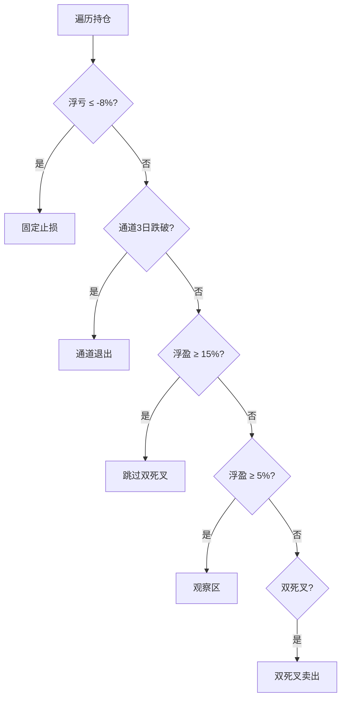

# 无效
# trade2at5 详细策略说明 — 分级双死叉

> 对应代码：`trade2at5`  
> 平台：聚宽（JoinQuant）  
> 基准：沪深300（000300.XSHG）  
> 基线：`trade2`（仅改造 **双死叉启用条件**）

---

## 1. 策略定位

### 1.1 一句话

trade2 中 BBI+MACD 双死叉 **始终启用**，常在盈利趋势单上过早卖出。trade2at5 按 **浮盈分层** 控制双死叉：大盈靠通道，微盈/亏损才用双死叉保护。

### 1.2 相对 trade2 的唯一改动

| 浮盈率 | trade2 | trade2at5 |
|--------|--------|-----------|
| ≥ 15% | 双死叉可触发 | **关闭双死叉** |
| 5% ~ 15% | 双死叉可触发 | **跳过（观察区）** |
| < 5% | 双死叉可触发 | **启用双死叉** |

---

## 2. 卖出优先级（10:00）



### 2.1 参数

| 参数 | 默认值 | 说明 |
|------|--------|------|
| `g.profit_skip_dead_cross` | 0.15 | ≥15% 关闭双死叉 |
| `g.loss_keep_dead_cross` | 0.05 | ≥5% 观察区 |

---

## 3. 设计依据（trade2_log）

| 原因 | trade2 |
|------|--------|
| 双死叉 | 24 次，胜率 8%，净 -81% |
| 通道 3 日 | 51 次，净 +110% |
| 持仓 >30 天 | 胜率 80% |

---

## 4. 未改动部分

- 3 只持仓、选股、固定止损 8%、通道 3 日
- 无跟踪止损（见 trade2at6）

---

## 5. 回测对比

| 基线 | `trade2` |
| 本版 | `trade2at5` |

**预期：** 胜率提升，双死叉误杀减少，盈利单持有期延长。

---

## 6. 文件关系

```
trade2 ──+── trade2at3 ~ at7
         └── trade2at5  (分级双死叉)  ← 本文档
```
