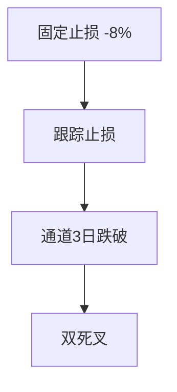

# trade2at6 详细策略说明 — 浮盈跟踪止损

> 对应代码：`trade2at6`  
> 平台：聚宽（JoinQuant）  
> 基准：沪深300（000300.XSHG）  
> 基线：`trade2`（仅新增 **浮盈跟踪止损**）

---

## 1. 策略定位

### 1.1 一句话

trade2 大盈单仅靠 **通道 3 日跌破** 退出，急跌时利润回吐大（如 +86% 仍持仓）。trade2at6 在浮盈达到阈值后，从 **持仓最高价** 计算回撤，触发 **跟踪止损** 锁利。

### 1.2 相对 trade2 的唯一改动

| 项目 | trade2 | trade2at6 |
|------|--------|-----------|
| 持仓最高价跟踪 | 无 | **g.position_high** |
| 大盈保护 | 仅通道 | **跟踪止损 + 通道** |
| 双死叉 | 始终启用 | 原样（未分级） |

---

## 2. 跟踪止损规则

### 2.1 最高价维护

- 买入时：`g.position_high[stock] = 买入价`
- 10:00 卖出检查前：用现价更新 `max(历史最高, 现价)`
- 15:00 盘后：用 **收盘价** 再更新一次

### 2.2 触发条件

| 当前浮盈率（相对成本） | 自最高价回撤 | 动作 |
|------------------------|--------------|------|
| ≥ **30%** | ≥ **8%** | 卖出，原因：跟踪止损(30%档) |
| ≥ **15%** | ≥ **12%** | 卖出，原因：跟踪止损(15%档) |
| < 15% | — | 不启用跟踪止损 |

```python
dd_from_peak = (现价 - 持仓最高价) / 持仓最高价
```

### 2.3 参数

| 参数 | 默认值 | 说明 |
|------|--------|------|
| `g.trail_profit_15` | 0.15 | 启用 15% 档跟踪 |
| `g.trail_profit_30` | 0.30 | 启用 30% 档（更紧） |
| `g.trail_stop_15` | 0.12 | 15% 档：自高点回撤 12% |
| `g.trail_stop_30` | 0.08 | 30% 档：自高点回撤 8% |

---

## 3. 卖出优先级（10:00）



跟踪止损在 **固定止损之后、通道之前**，避免大盈变亏损才退出。

---

## 4. 示例

| 成本 | 最高价 | 现价 | 浮盈 | 自高点回撤 | 结果 |
|------|--------|------|------|------------|------|
| 100 | 130 | 118 | +18% | -9.2% | 未触发（需 -12%） |
| 100 | 130 | 114 | +14% | -12.3% | **15%档触发** |
| 100 | 150 | 138 | +38% | -8% | **30%档触发** |

---

## 5. 未改动部分

- 选股、3 只持仓、大盘评分
- 固定止损 8%、通道 3 日、双死叉（仍始终启用）
- 无分级双死叉（见 trade2at5）

---

## 6. 与 trade2at5 对比

| 版本 | 机制 |
|------|------|
| trade2at5 | 关双死叉，大盈靠通道 |
| trade2at6 | 跟踪止损主动锁利 |

建议 **分别回测**；若合并效果好，可在后续 `trade2at9` 合并两项。

---

## 7. 日志示例

```
📉 跟踪止损(30%档) 300975.XSHE，浮盈38.0%，自高点150.00回撤8.0%
```

---

## 8. 回测对比

| 基线 | `trade2` |
| 本版 | `trade2at6` |

**重点：** 大盈单最终落袋比例、最大回撤、2026 类「高浮盈回吐」场景。

---

## 9. 文件关系

```
trade2 ──+── trade2at3  (组合回撤刹车)
         ├── trade2at4  (止损改造)
         ├── trade2at5  (分级双死叉)
         ├── trade2at6  (浮盈跟踪止损)  ← 本文档
         └── trade2at7  (评分双向联动)
```
