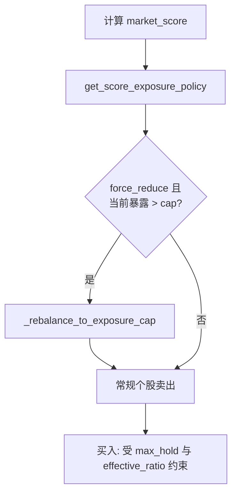

# trade2at7 详细策略说明 — 大盘评分双向联动

> 对应代码：`trade2at7`  
> 平台：聚宽（JoinQuant）  
> 基准：沪深300（000300.XSHG）  
> 基线：`trade2`（仅改造 **大盘评分 → 仓位** 为双向联动）

---

## 1. 策略定位

### 1.1 一句话

trade2 中 `position_ratio` **只约束新开仓**：评分 <30 停买，但已有 3 只满仓继续扛单。trade2at7 让大盘评分同时约束 **最大总暴露** 与 **最大持仓数**，评分走弱时 **主动减仓**。

### 1.2 相对 trade2 的唯一改动

| 项目 | trade2 | trade2at7 |
|------|--------|-----------|
| 评分作用 | 仅买入目标仓 | **买入 + 存量减仓** |
| 弱市已有仓 | 不减 | **降至暴露上限** |
| 止损/通道/双死叉 | 原样 | 原样 |

---

## 2. 评分 → 暴露政策

函数：`get_score_exposure_policy(market_score)`  
返回：`(exposure_cap, max_holdings, force_reduce)`

| 大盘评分 | 最大总暴露 | 最大持仓 | 强制减仓 |
|----------|------------|----------|----------|
| **< 30** | **20%** | **0**（禁买） | 是 |
| **30 ~ 40** | **40%** | **2** | 是 |
| **40 ~ 55** | **60%** | **3** | 是 |
| **≥ 55** | `calculate_position_ratio` | **3** | 否 |

### 2.1 有效买入仓位

```python
effective_ratio = min(calculate_position_ratio(market_score), exposure_cap)
per_stock_target = 总资产 × effective_ratio / max_hold_allowed
```

---

## 3. 执行流程（10:00）



### 3.1 减仓逻辑

1. **超持仓数：** 评分 30~40 且持有 3 只 → 按浮盈排序，卖出最弱直到 ≤2 只  
2. **超总暴露：** 持仓总市值 / 总资产 > `exposure_cap` → 每只等比例减至目标  

**评分 <30：** 目标暴露 20%；超则按比例减仓。

---

## 4. 买入规则变化

| 条件 | trade2 | trade2at7 |
|------|--------|-----------|
| 评分 <30 | 停买 | 停买 + 减至 20% 暴露 |
| 评分 30~40 | 买至 3 只 | **最多 2 只**，暴露 ≤40% |
| 评分 40~55 | 正常 | 暴露 ≤60% |
| 评分 ≥55 | 正常 | 与 trade2 相同 |

---

## 5. 日志示例

```
大盘评分: 35 → 目标仓位: 60.0% | 联动上限: 40.0% | 有效: 40.0% | 最大持仓: 2
评分联动减仓：当前暴露 78.5% → 目标 40.0%
📉 评分联动：卖出超仓 600338.XSHG
```

---

## 6. 回测对比

| 基线 | `trade2` |
| 本版 | `trade2at7` |

**重点：** 2022 年暴露、最大回撤、熊市净贡献。

---

## 7. A/B 回测矩阵

| 编号 | 策略 | 文档 |
|------|------|------|
| 0 | trade2 | trade2a.md |
| 1 | +组合回撤刹车 | trade2at3a.md |
| 2 | +止损改造 | trade2at4a.md |
| 3 | +分级双死叉 | trade2at5a.md |
| 4 | +浮盈跟踪止损 | trade2at6a.md |
| 5 | +评分双向联动 | trade2at7a.md |

---

## 8. 文件关系

```
trade2 ──+── trade2at3 ~ at6
         └── trade2at7  (评分双向联动)  ← 本文档
```
